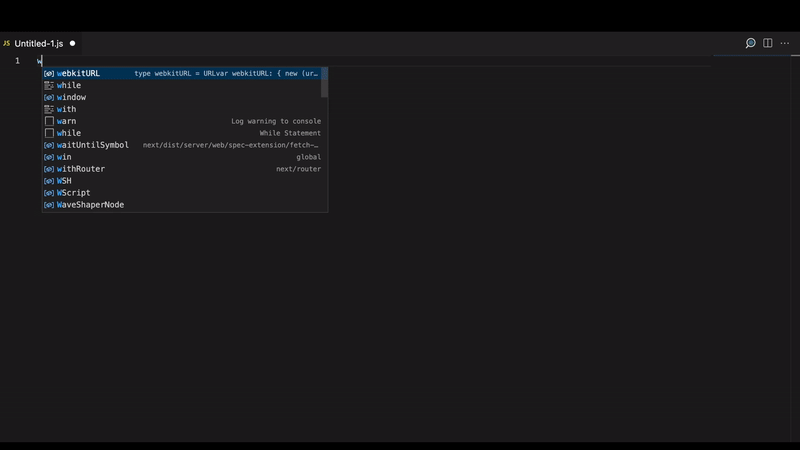

# connect-to-openai README

A Visual Studio Code extension that allows developers to quickly and easily send text to [OpenAI](https://openai.com) and have the results pasted directly into their editor. With this extension, developers can quickly and easily access OpenAI's powerful natural language processing capabilities without ever leaving their editor.

You must have an API to use this extension. All configuration options in a normal api call to OpenAI are configurable in the extension settings and defaulted to the same values found in [OpenAI's documentation](https://beta.openai.com/docs/api-reference/completions/create).

Do not misue or abuse an API key you are not authorized to use. Do not misues or abuse OpenAI technology nor violate any of their terms and conditions while using Connect To OpenAI. I am not responsible for the use of another individuals or entities confidential information. 

## Features

### Prompt OpenAI

Just select your intended prompt and run the 'Prompt OpenAI' command. The results will be pasted into your editor below the selected text!

## Requirements

- OpenAI API Key

## Extension Settings

This extension contributes the following settings:

* `connect-to-openai.apiKey`: OpenAI API Key
* `connect-to-openai.parameters.model`: Model to use for the prompt
* `connect-to-openai.parameters.suffix`: The suffix that comes after a completion of inserted text.
* `connect-to-openai.parameters.max_tokens`: The maximum number of tokens to generate in the completion.
* `connect-to-openai.parameters.temperature`: What sampling temperature to use. Higher values means the model will take more risks.
* `connect-to-openai.parameters.top_p`: An alternative to sampling with temperature, called nucleus sampling, where the model considers the results of the tokens with top_p probability mass.
* `connect-to-openai.parameters.n`: How many completions to generate for each prompt.
* `connect-to-openai.parameters.stream`: Whether to stream back partial progress. If set, tokens will be sent as data-only server-sent events as they become available, with the stream terminated by a data: [DONE] message.
* `connect-to-openai.parameters.logprobs`: Include the log probabilities on the logprobs most likely tokens, as well the chosen tokens.
* `connect-to-openai.parameters.echo`: Echo back the prompt in addition to the completion
* `connect-to-openai.parameters.stop`: Up to 4 sequences where the API will stop generating further tokens. The returned text will not contain the stop sequence.
* `connect-to-openai.parameters.presence_penalty`: Number between -2.0 and 2.0. Positive values penalize new tokens based on whether they appear in the text so far, increasing the model's likelihood to talk about new topics.
* `connect-to-openai.parameters.frequency_penalty`: Number between -2.0 and 2.0. Positive values penalize new tokens based on their existing frequency in the text so far, decreasing the model's likelihood to repeat the same line verbatim.
* `connect-to-openai.parameters.best_of`: Generates best_of completions server-side and returns the 'best' (the one with the highest log probability per token). Results cannot be streamed.
* `connect-to-openai.parameters.logit_bias`: Modify the likelihood of specified tokens appearing in the completion.

## Known Issues

None

## Release Notes

### 1.0.0
Initial release of Connect To OpenAI
